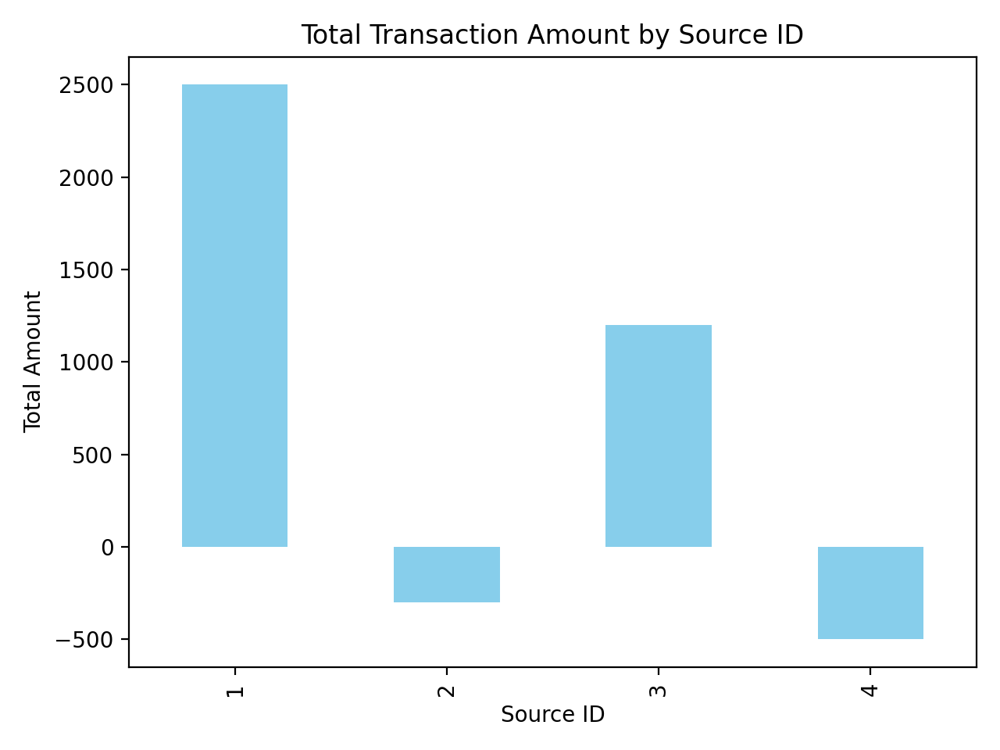
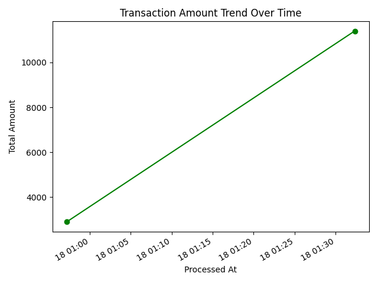
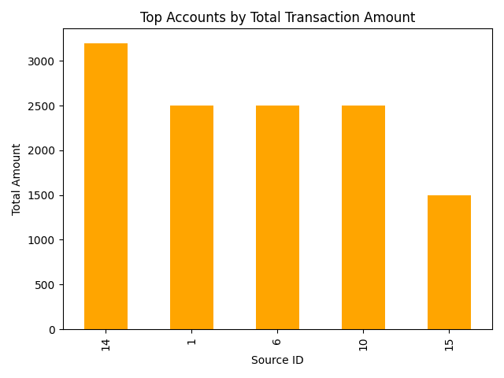

# Analytics-UAT-Framework

	

	

	

---

## 🏆 Real-Life Data Outcomes

**Business Scenario:**
This project now uses realistic business transaction data, including sales, refunds, and expenses across multiple accounts and currencies.

**Key Visual Results:**
- <b>Transaction Amounts by Source</b>: Bar chart showing total amounts per account
- <b>Transaction Trends Over Time</b>: Line chart visualizing business activity and anomalies
- <b>Top Accounts</b>: Bar chart highlighting the accounts with the highest transaction volumes

---

## 📊 Full Project Description

**Analytics-UAT-Framework** is a comprehensive platform designed to deliver actionable business insights and robust data quality assurance. It ingests, reconciles, and analyzes data from multiple sources, automates reporting, and provides a user acceptance testing (UAT) workflow to ensure reliability and stakeholder confidence. The project is ideal for finance, operations, and any data-driven business domain.

### Key Features
- Multi-source data ingestion and reconciliation (CSV, database, API)
- Automated ETL pipeline using Python and PostgreSQL
- Advanced analytics and anomaly detection
- Interactive dashboards and exportable reports (PDF, PNG)
- UAT framework: test cases, logs, approval workflow
- Agile project management and executive-ready documentation

### Technical Stack
- Python (ETL, analytics, visualization)
- PostgreSQL (relational database)
- Pandas, Matplotlib (data analysis & charts)
- Git & GitHub (version control, collaboration)

### Outcomes
- Transaction amounts and trends visualized for business decision-making
- UAT results and audit logs for quality assurance
- Ready-to-present documentation and executive summaries

### How to Use
1. Set up PostgreSQL and initialize the schema
2. Ingest sample or real data using the ETL script
3. Run analytics and visualization scripts for insights
4. Review UAT plan and test results
5. Present findings using generated reports and charts

---

## 👤 Author

**KM Shayshab Azad**

- Data Analytics & Automation Specialist
- Expertise: Data engineering, analytics, business intelligence, UAT, project management
- Contact: [LinkedIn](https://www.linkedin.com/in/shayshabazad/) | [GitHub](https://github.com/shayshab)

---

## 🚀 Project Outcomes & Highlights

**Business Value Delivered:**
- Automated ingestion and reconciliation of transactional data from multiple sources
- Real-time analytics and anomaly detection for business operations
- Interactive dashboards and exportable reports (PDF, PNG)
- UAT framework for quality assurance and stakeholder confidence
- Executive-ready documentation and presentations

**Key Visual Outcomes:**
- <b>Transaction Amounts by Source</b>: Bar chart showing total amounts per data source
- <b>Transaction Trends Over Time</b>: Line chart visualizing business activity and anomalies

---
