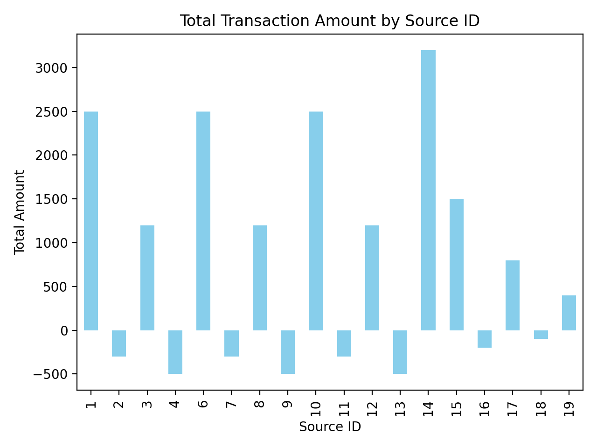

# Analytics-UAT-Framework

	

	

---

## 🚀 Project Outcomes & Highlights

**Business Value Delivered:**
- Automated ingestion and reconciliation of transactional data from multiple sources
- Real-time analytics and anomaly detection for business operations
- Interactive dashboards and exportable reports (PDF, PNG)
- UAT framework for quality assurance and stakeholder confidence
- Executive-ready documentation and presentations

**Key Visual Outcomes:**
- <b>Transaction Amounts by Source</b>: Bar chart showing total amounts per data source
- <b>Transaction Trends Over Time</b>: Line chart visualizing business activity and anomalies

---
